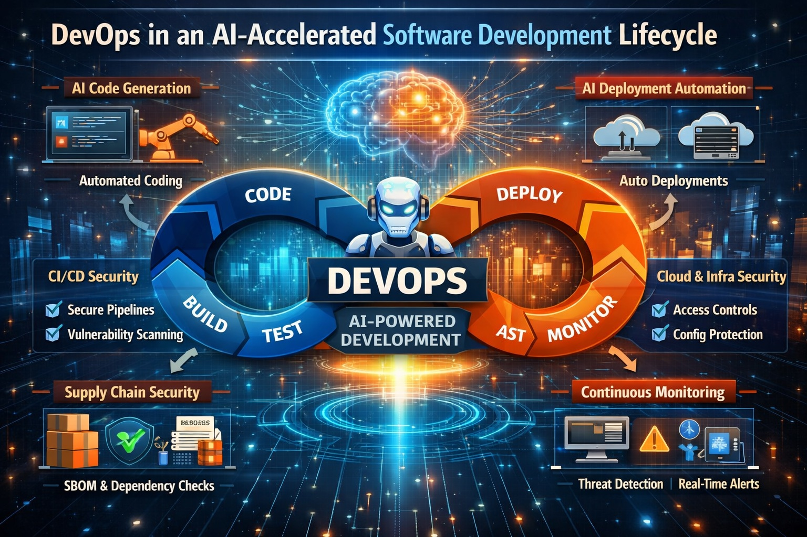

+++
title = "DevOps and CI/CD Security: Why It Matters on Day One"
date = "2026-03-06T12:47:08+02:00"
tags = ["devops", "ai", "security", "devsecops", "cicd"]
categories = ["engineering", "DevOps"]
banner = "img/banners/devops-with-ai.jpg"
facebook_author = "Anand Vijayan"
+++

Software development has always moved quickly, but today it is accelerating at unprecedented speed. With AI agents generating code, automating deployments, and assisting developers in real time, organizations are shipping software faster than ever before.

While this rapid innovation creates tremendous opportunity, it also introduces significant risk. In a world where code can be generated and deployed in minutes, security can no longer be treated as an afterthought. DevOps and CI/CD security must be implemented from day one.

Security integrated directly into the development and deployment pipeline is no longer optional—it is essential for protecting applications, infrastructure, and customer trust.

---

## The New Reality: AI-Accelerated Development

AI-powered development tools are transforming how software is built.

Developers now use AI agents to:

- Generate code in seconds  
- Create infrastructure automatically  
- Build entire applications from prompts  
- Automate testing and deployment  
- Scale software projects rapidly  

This shift dramatically reduces development time, but it also increases the velocity at which vulnerabilities can enter production systems.

In the past, developers might manually write hundreds of lines of code over several days. Today, AI agents can generate thousands of lines of code instantly. If proper security checks are not integrated into the development pipeline, vulnerabilities can propagate just as quickly.

---

## Why DevOps Security Must Start on Day One

Security that is bolted on later rarely works effectively. When security is treated as a final stage before production, teams often encounter the following problems:

- Security reviews slow down releases  
- Developers must rewrite large sections of code  
- Vulnerabilities accumulate unnoticed  
- Compliance becomes difficult to maintain  

By integrating security from the beginning of the DevOps lifecycle, organizations can ensure that vulnerabilities are detected early—before they become costly or dangerous.

This approach is commonly referred to as **DevSecOps**, where security becomes a shared responsibility across development, operations, and security teams.

---

## The Critical Role of CI/CD Pipeline Security

The CI/CD pipeline is the central nervous system of modern software development. It automates how code moves from development to production.

Because of this, it has become a prime target for attackers.

If compromised, a CI/CD pipeline can allow attackers to:

- Inject malicious code into software releases  
- Access secrets and credentials  
- Modify infrastructure configurations  
- Deploy backdoors into production systems  

In other words, compromising the pipeline often provides direct access to the entire application ecosystem.

Protecting the CI/CD pipeline is therefore one of the most critical security responsibilities in modern DevOps environments.

---

## Key Security Practices for Modern DevOps Pipelines

### 1. Secure the Software Supply Chain

Modern applications rely heavily on third-party libraries and dependencies. Many security incidents originate from compromised dependencies.

Best practices include:

- Dependency vulnerability scanning  
- Software Bill of Materials (SBOM)  
- Trusted package repositories  
- Version pinning and validation  

---

### 2. Protect Secrets and Credentials

Secrets such as API keys, tokens, and certificates should never be embedded directly in source code.

Secure pipelines use:

- Dedicated secrets management systems  
- Temporary credentials  
- Role-based access controls  
- Automated secret rotation  

---

### 3. Implement Automated Security Scanning

Automated security testing should be integrated directly into the CI/CD workflow.

Common scanning techniques include:

- Static Application Security Testing (SAST)  
- Dynamic Application Security Testing (DAST)  
- Container image scanning  
- Infrastructure-as-Code (IaC) scanning  

Automation ensures that every code change is evaluated for security risks before deployment.

---

### 4. Enforce Least Privilege Access

CI/CD pipelines often require access to multiple systems including repositories, cloud platforms, and deployment environments.

However, excessive permissions can create major vulnerabilities.

Organizations should enforce:

- Role-based access control  
- Minimal required permissions  
- Temporary credentials  
- Environment isolation  

---

### 5. Secure Build and Deployment Infrastructure

Build servers and runners are powerful systems that compile and deploy software. If compromised, they can introduce malicious code into trusted releases.

Security practices include:

- Isolated build environments  
- Ephemeral build runners  
- Verified build artifacts  
- Signed software releases  

---

## AI Agents Make Security Even More Critical

AI-powered development introduces a new dimension to software security.

AI agents can:

- Generate code that developers may not fully understand  
- Introduce insecure patterns  
- Depend on unverified third-party packages  
- Create automation workflows that bypass traditional security controls  

Without strong security safeguards in the pipeline, these risks can multiply quickly.

However, the same AI technologies can also strengthen security when used properly. AI-powered tools can:

- Detect anomalies in pipelines  
- Identify vulnerable code patterns  
- Monitor software supply chains  
- Automate security testing at scale  

The key is ensuring that AI accelerates **secure development**, not insecure deployment.

---

## Security as a Competitive Advantage

Organizations that prioritize DevOps security from day one gain significant advantages:

- Faster secure deployments  
- Reduced vulnerability exposure  
- Stronger customer trust  
- Easier regulatory compliance  
- Lower incident response costs  

In a world where software powers nearly every industry, security is no longer just a technical requirement—it is a business imperative.

---

## Conclusion

The age of AI-powered development is transforming how quickly software can be built and deployed. But speed without security is dangerous.

DevOps and CI/CD security must be embedded into the development lifecycle from the very beginning. By integrating security controls directly into pipelines, organizations can move fast without sacrificing safety.

In the era of AI-driven innovation, the most successful companies will not just build software faster—they will build it **securely from day one**.
