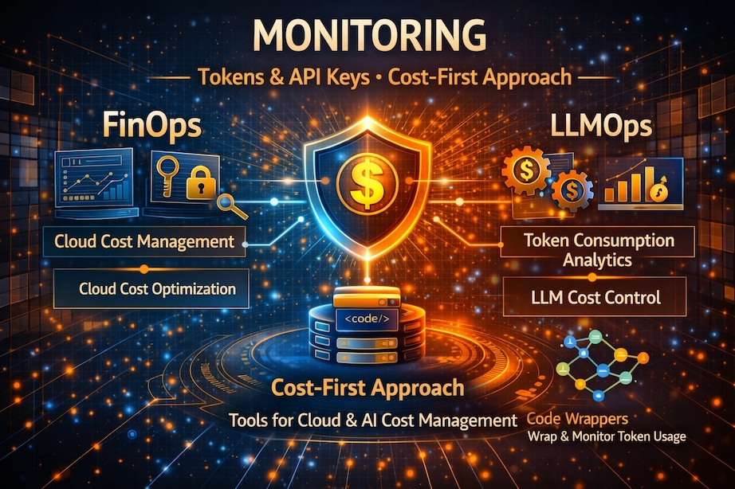

+++
title = "Monitoring AI Infrastructure: Fundamentals, Token Tracking, and Cost Control"
date = "2026-03-30T15:58:08+02:00"
description = "A comprehensive guide to monitoring AI systems, tracking tokens across providers like OpenAI and Anthropic, and minimizing costs with FinOps and LLM Ops strategies. Includes practical examples with LangChain, LangGraph, and vanilla implementations."
tags = ["devops", "ai", "monitoring", "finops", "llmops", "aiops", "observability", "token tracking", "cost control", "llm", "openai", "anthropic", "langchain", "langgraph", "prometheus", "grafana", "phoenix devops"]
categories = ["AI", "Monitoring", "DevOps", "FinOps", "LLMOps"]
weight = 10
banner = "img/banners/monitoring-ai.jpg"
facebook_author = "Anand Vijayan"
keywords = ["ai monitoring", "token tracking", "cost optimization", "llm ops", "finops", "devops", "phoenix devops", "ai infrastructure", "observability", "prometheus", "grafana"]
+++

Monitoring is the heartbeat of reliable systems, and in AI-driven services it’s mission-critical. For LLM Ops and FinOps, the signal-to-cost ratio is the top priority: we measure quality, efficiency, and spend together. This guide covers basics of monitoring, how to observe AI infrastructure, how to track tokens across providers, how to use token data for cost-first LLM operations, and practical cost minimization strategies.

<!--more-->

## 1. Monitoring Basics (for any stack)

### 1.1 What to collect

- **Availability (ping, health endpoints)**: Track whether your services are up and responding. Use simple health checks like HTTP GET requests to `/health` or `/status` endpoints that return 200 OK when the service is healthy. Example: A health endpoint that checks database connectivity, model loading status, and basic API responsiveness.
- **Latency (API response time, model inference time)**: Measure how long requests take from start to finish. For AI systems, track both API-level latency (time to receive response) and inference latency (time spent in model computation). Example: P95 latency should be under 2 seconds for chat applications, with inference time under 500ms for real-time use cases.
- **Errors/failures (HTTP 5xx, request validation failures, model exceptions)**: Monitor error rates and types. Track HTTP 5xx server errors, client-side 4xx errors, model-specific failures like token limit exceeded, and validation errors. Example: Alert when error rate exceeds 1% over 5 minutes, or when model hallucinations occur in 0.5% of responses.
- **Resource usage (CPU, memory, GPU, disk, network)**: Monitor system resources consumed by AI workloads. Track GPU utilization (should be >80% during inference), memory usage (watch for leaks), CPU usage, disk I/O for model loading, and network bandwidth for data transfer. Example: GPU memory usage spikes during batch processing, or network saturation during model downloads.
- **Business metrics (requests/sec, user sessions, revenue events)**: Track usage patterns and business impact. Monitor throughput (requests per second), concurrent users, session duration, and revenue-generating events. Example: Track daily active users, average session length, and conversion rates from free to paid tier usage.

### 1.2 Common tools (non-AI-specific)

- **Metrics: Prometheus + Grafana, Datadog, CloudWatch**: Prometheus scrapes metrics from services and stores them in a time-series database. Grafana provides visualization dashboards. Datadog and CloudWatch offer SaaS alternatives with built-in alerting. Example: Use Prometheus exporters to collect system metrics, then create Grafana dashboards showing CPU usage trends over time.
- **Logs: ELK (Elasticsearch/Logstash/Kibana), Loki, Splunk**: ELK stack aggregates logs from multiple sources, indexes them in Elasticsearch, and provides Kibana for querying and visualization. Loki is a lightweight alternative focused on Kubernetes environments. Example: Centralize application logs, API request logs, and error traces in ELK for debugging failed requests.
- **Traces: OpenTelemetry, Jaeger, Zipkin**: Distributed tracing tools track requests across microservices. OpenTelemetry provides instrumentation libraries for multiple languages. Jaeger and Zipkin visualize trace data. Example: Trace a user request from API gateway through authentication, model inference, and response formatting.
- **Alerts: PagerDuty, Opsgenie, Alertmanager**: Alert management systems route notifications to on-call engineers. PagerDuty and Opsgenie provide scheduling and escalation. Alertmanager (part of Prometheus) handles alert routing. Example: Page engineers when API error rate exceeds 5% for 2 minutes, or when GPU utilization drops below 10% unexpectedly.

### 1.3 Monitoring workflow

1. **Instrument services (SDKs, middleware, export metrics)**: Add monitoring code to your applications using SDKs like OpenTelemetry or Prometheus client libraries. Instrument HTTP handlers, database calls, and external API requests. Example: Add Prometheus metrics to your Go HTTP server to track request count, duration, and error rates per endpoint.
2. **Centralize logs/metrics/traces**: Send all telemetry data to a central system. Use log shippers like Fluentd or Filebeat to forward logs. Configure metrics exporters and tracing collectors. Example: Deploy a centralized ELK stack where all services send structured JSON logs with consistent field names.
3. **Define SLOs/SLAs (e.g., 99.9p latency, <0.1% error)**: Set service level objectives based on user expectations and business requirements. Define what "good" performance means. Example: SLA guarantees 99.9% uptime and P95 latency under 500ms for premium users, with financial penalties for violations.
4. **Create dashboards and alert rules**: Build visualizations showing key metrics and set up alerts for anomalies. Use Grafana for dashboards and Alertmanager for notifications. Example: Create a dashboard showing real-time request rates, error percentages, and resource utilization across all services.
5. **Run postmortems, adjust thresholds and capacity planning**: After incidents, analyze what went wrong and update monitoring. Adjust alert thresholds based on normal operating patterns. Example: After a database outage, add monitoring for connection pool usage and implement auto-scaling based on request queue depth.

## 2. AI Infrastructure Monitoring

AI workloads add model pipelines, inference GPUs, latent state, and token billing variability.

### 2.1 What’s unique in AI

- **Model input/output and behavior drift**: AI models can produce different outputs for the same input over time due to training data changes or fine-tuning. Monitor for consistency in responses and detect when model behavior changes unexpectedly. Example: Track response similarity scores and alert when a customer support chatbot starts giving different answers to the same question.
- **Token counts, prompt size, context length**: Track how many tokens are used in prompts and completions, as this directly affects cost and performance. Monitor context window utilization to prevent truncation. Example: Alert when average prompt length increases by 50%, indicating users are asking more complex questions that may exceed model limits.
- **Model version and weights (A/B tests)**: When deploying new model versions, track performance differences. Use feature flags or canary deployments to test new models. Example: Run A/B tests comparing GPT-4 vs GPT-3.5-turbo, measuring both quality (user satisfaction) and cost (tokens per response).
- **GPU/TPU metrics (utilization, memory, tensor core utilization)**: AI inference requires specialized hardware. Monitor GPU memory usage, compute utilization, and thermal throttling. Example: Track that GPU utilization stays above 70% during peak hours, and memory usage doesn't exceed 90% to prevent out-of-memory errors.
- **Data quality incidents (e.g., hallucinations, injection)**: Monitor for AI-specific failures like generating false information or being vulnerable to prompt injection attacks. Example: Implement content filters that detect when responses contain factually incorrect information or attempt to break security boundaries.

### 2.2 Key signals for AI systems

- **Inference latency by model/version**: Track how long different models take to generate responses. Monitor for performance regressions when updating models. Example: GPT-4 takes 3-5 seconds for complex reasoning tasks, while GPT-3.5-turbo responds in under 1 second for simpler queries.
- **Token consumption (prompt + completion)**: Monitor token usage patterns to understand cost drivers and optimize prompts. Track token efficiency (output tokens per input token). Example: A summarization task might use 1000 input tokens to generate 200 output tokens, giving a 5:1 input-to-output ratio.
- **Throughput (queries per sec, sessions per min)**: Measure how many requests your AI system can handle. Track concurrent users and request queuing. Example: A chat application handles 100 queries per second during peak hours, with average session duration of 15 minutes.
- **Accuracy/f1 for ML models**: For classification tasks, track precision, recall, and F1 scores. Monitor model performance degradation over time. Example: A sentiment analysis model maintains 92% accuracy, with alerts triggered if accuracy drops below 85%.
- **AI-specific errors (rate limit, context overflow)**: Track errors unique to AI APIs like rate limiting, token limits exceeded, or context window overflow. Example: Monitor for "maximum context length exceeded" errors and implement prompt truncation strategies.

### 2.3 Example stack (platform-agnostic)

- **Inference service: expose `/health`, `/metrics` (Prometheus)**: Your AI service should provide health checks and metrics endpoints. The `/health` endpoint returns service status, while `/metrics` exposes Prometheus-formatted metrics. Example: Health check verifies model is loaded, GPU is available, and external APIs are reachable.
- **Runtime: gather GPU stats via `nvidia-smi`, `dcgm-exporter`**: Use NVIDIA tools to monitor GPU health and performance. `nvidia-smi` provides basic stats, while DCGM exporter integrates with Prometheus. Example: Monitor GPU temperature, memory usage, and utilization percentage across all GPUs in your cluster.
- **Model observability: emit events for `modelName`, `modelVersion`, `response_quality`**: Track which models are being used and how well they're performing. Emit structured events for analysis. Example: Log events with model metadata, response time, and quality scores for each inference request.
- **Tracing: instrument request path from ingress → model server → response**: Use distributed tracing to follow requests through your AI pipeline. Track timing for each component. Example: Trace shows request flows from load balancer → authentication → input preprocessing → model inference → output formatting → response.

## 3. Token tracking across providers (LLM Ops + FinOps)

### 3.1 Why tokens matter for LLM Ops

In LLM Ops, tokens are the operating units. Token metrics should be first-class observability signals alongside retries, latency, and model drift.

- **Alert on token spikes per request (e.g., a prompt suddenly uses 10x tokens)**: Monitor for unusual token consumption that could indicate prompt injection, inefficient prompting, or model misuse. Example: A normally 100-token request suddenly uses 1000 tokens, potentially indicating someone is trying to bypass content filters.
- **Track token efficiency by endpoint/model (tokens per successful response)**: Measure how effectively your prompts generate useful output. Calculate tokens per valuable response. Example: A customer support chatbot averages 50 input tokens to generate 100 output tokens, giving a 2:1 efficiency ratio.
- **Link tokens to cost buckets (e.g., `llm.cost.USD`) in billing pipeline**: Connect token usage directly to financial metrics for chargeback and budgeting. Example: Tag tokens by department or project, then generate monthly cost reports showing which teams consume the most AI resources.

### 3.2 FinOps cost-first token tracking strategy

- **Collect per-call metrics**: Capture detailed token and cost data for every AI API call. Include prompt tokens (input), completion tokens (output), and total tokens used. Example: A chat completion request uses 150 prompt tokens for the user's question and 200 completion tokens for the AI's response, totaling 350 tokens.
- **Persist to long-term store (Prometheus + ClickHouse / InfluxDB + Snowflake)**: Store metrics in systems designed for time-series data and analytical queries. Use Prometheus for real-time monitoring, ClickHouse for fast analytical queries, and Snowflake for enterprise data warehousing. Example: Store 30 days of granular metrics in Prometheus, then aggregate monthly summaries in Snowflake for executive reporting.
- **Use billing pipeline to tie usage to business dimensions (team, product, feature)**: Connect technical metrics to business context. Tag requests with team names, product features, or customer segments. Example: Attribute costs to specific features like "code generation" vs "content summarization" to understand which capabilities drive the most value.
- **Maintain rolling cost budgets and token spend forecasts (7/30 day windows)**: Track spending trends and predict future costs. Set budget alerts and implement cost controls. Example: Monitor that monthly AI spend stays under $50,000, with alerts at 80% and 95% of budget thresholds.

### 3.3 Practical token tracking implementations

  <button onclick="showCode('python-panel', this)">Python</button>
  <button onclick="showCode('go-panel', this)">Go</button>
  <button onclick="showCode('nodejs-panel', this)">Node.js</button>
  <button onclick="showCode('typescript-panel', this)">TypeScript</button>

<pre><code class="language-python">from prometheus_client import Counter
from openai import OpenAI

llm = OpenAI()

TOKEN_COUNTER = Counter(
    'llm_tokens_total',
    'Total tokens used by LLM request',
    ['provider', 'model', 'task', 'category', 'status']
)

COST_COUNTER = Counter(
    'llm_cost_usd_total',
    'Total cost in USD for LLM requests',
    ['provider', 'model', 'task', 'category']
)

RATE_TABLE = {'gpt-4': 0.03 / 1000, 'gpt-3.5': 0.002 / 1000}

def calculate_cost(model: str, total_tokens: int) -> float:
    rate = RATE_TABLE.get(model, 0.005 / 1000)
    return total_tokens * rate

def track_llm_call(provider, model, task, category, tokens, status):
    TOKEN_COUNTER.labels(provider, model, task, category, status).inc(tokens)
    COST_COUNTER.labels(provider, model, task, category).inc(calculate_cost(model, tokens))

def call_llm(prompt: str, model: str = 'gpt-3.5'):
    res = llm.responses.create(model=model, input=prompt)
    usage = res['usage']
    total_tokens = usage['prompt_tokens'] + usage.get('completion_tokens', 0)
    track_llm_call('openai', model, 'chat', 'interactive', total_tokens, 'ok')
    return res['output'][0]['content'][0]['text']
</code></pre>

<pre><code class="language-go">package llmops

import (
    "context"
    "github.com/sashabaranov/go-openai"
    "github.com/prometheus/client_golang/prometheus"
)

var (
    tokenCounter = prometheus.NewCounterVec(
        prometheus.CounterOpts{Name: "llm_tokens_total", Help: "Total LLM tokens."},
        []string{"provider", "model", "task", "category", "status"},
    )
    costCounter = prometheus.NewCounterVec(
        prometheus.CounterOpts{Name: "llm_cost_usd_total", Help: "Total LLM cost USD."},
        []string{"provider", "model", "task", "category"},
    )
)

func init() {
    prometheus.MustRegister(tokenCounter, costCounter)
}

var rateTable = map[string]float64{"gpt-4": 0.03 / 1000, "gpt-3.5": 0.002 / 1000}

func calculateCost(model string, tokens int) float64 {
    rate, ok := rateTable[model]
    if !ok {
        rate = 0.005 / 1000
    }
    return float64(tokens) * rate
}

func TrackLLMCall(provider, model, task, category, status string, tokens int) {
    tokenCounter.WithLabelValues(provider, model, task, category, status).Add(float64(tokens))
    costCounter.WithLabelValues(provider, model, task, category).Add(calculateCost(model, tokens))
}

func CallLLM(ctx context.Context, client *openai.Client, prompt, model string) (string, error) {
    resp, err := client.CreateChatCompletion(ctx, openai.ChatCompletionRequest{
        Model: model,
        Messages: []openai.ChatCompletionMessage{{Role: "user", Content: prompt}},
    })
    if err != nil {
        TrackLLMCall("openai", model, "chat", "interactive", "error", 0)
        return "", err
    }
    tokens := resp.Usage.PromptTokens + resp.Usage.CompletionTokens
    TrackLLMCall("openai", model, "chat", "interactive", "ok", tokens)
    return resp.Choices[0].Message.Content, nil
}
</code></pre>

<pre><code class="language-javascript">const { OpenAIApi, Configuration } = require('openai');
const client = new OpenAIApi(new Configuration({ apiKey: process.env.OPENAI_API_KEY }));
const prometheus = require('prom-client');

const tokenCounter = new prometheus.Counter({
  name: 'llm_tokens_total',
  help: 'Total tokens used by LLM request',
  labelNames: ['provider', 'model', 'task', 'category', 'status'],
});

const costCounter = new prometheus.Counter({
  name: 'llm_cost_usd_total',
  help: 'Total cost in USD for LLM requests',
  labelNames: ['provider', 'model', 'task', 'category'],
});

const RATE_TABLE = { 'gpt-4': 0.03 / 1000, 'gpt-3.5': 0.002 / 1000 };

function calculateCost(model, tokens) {
  const rate = RATE_TABLE[model] ?? 0.005 / 1000;
  return tokens * rate;
}

function trackCall(model, task, category, status, tokens) {
  tokenCounter.inc({ provider: 'openai', model, task, category, status }, tokens);
  costCounter.inc({ provider: 'openai', model, task, category }, calculateCost(model, tokens));
}

async function callLLM(prompt, model = 'gpt-3.5-turbo') {
  const res = await client.createChatCompletion({
    model,
    messages: [{ role: 'user', content: prompt }],
  });

  const usage = res.data.usage;
  const tokens = usage.prompt_tokens + usage.completion_tokens;
  trackCall(model, 'chat', 'interactive', 'ok', tokens);

  return res.data.choices[0].message.content;
}
</code></pre>

<pre><code class="language-typescript">import { Configuration, OpenAIApi } from 'openai';
import { Counter } from 'prom-client';

const client = new OpenAIApi(new Configuration({ apiKey: process.env.OPENAI_API_KEY }));

const tokenCounter = new Counter({
  name: 'llm_tokens_total',
  help: 'Total tokens used by LLM request',
  labelNames: ['provider', 'model', 'task', 'category', 'status'] as const,
});

const costCounter = new Counter({
  name: 'llm_cost_usd_total',
  help: 'Total cost in USD for LLM requests',
  labelNames: ['provider', 'model', 'task', 'category'] as const,
});

const RATE_TABLE: Record&lt;string, number&gt; = { 'gpt-4': 0.03 / 1000, 'gpt-3.5': 0.002 / 1000 };

function calculateCost(model: string, tokens: number): number {
  const rate = RATE_TABLE[model] ?? 0.005 / 1000;
  return tokens * rate;
}

function trackCall(model: string, task: string, category: string, status: string, tokens: number) {
  tokenCounter.inc({ provider: 'openai', model, task, category, status }, tokens);
  costCounter.inc({ provider: 'openai', model, task, category }, calculateCost(model, tokens));
}

export async function callLLM(prompt: string, model = 'gpt-3.5-turbo'): Promise&lt;string&gt; {
  const res = await client.createChatCompletion({
    model,
    messages: [{ role: 'user', content: prompt }],
  });

  const usage = res.data.usage;
  const tokens = (usage?.prompt_tokens ?? 0) + (usage?.completion_tokens ?? 0);
  trackCall(model, 'chat', 'interactive', 'ok', tokens);

  return res.data.choices?.[0]?.message?.content ?? '';
}
</code></pre>

### 3.5 Cross-provider comparison metric

- **Normalize to "tokens per second" and "cost per 1k tokens"**: Create standardized metrics to compare AI providers fairly. Calculate throughput in tokens processed per second, and cost efficiency in dollars per thousand tokens. Example: GPT-4 costs $0.03 per 1K tokens while Claude costs $0.015 per 1K tokens, making Claude 50% cheaper for the same capability.
- **Maintain one canonical metric for inference efficiency: `llm_tokens_per_usd`**: Create a single, authoritative metric that combines cost and performance. This shows how many tokens you get per dollar spent. Example: A well-optimized system delivers 30,000 tokens per dollar, while inefficient prompting might only deliver 10,000 tokens per dollar.
- **Use these metrics for FinOps decisions: model rollouts, cost-cap enforcement, and feature gating**: Apply metrics to business decisions. Choose models based on cost-efficiency, enforce spending limits, and enable/disable features based on ROI. Example: Automatically route simple queries to cheaper models, saving 60% on costs while maintaining 95% of the quality.

## 4. Cost minimization in AI systems

### 4.1 Observability-driven cost control

- **Establish baseline token usage, total cost, request count**: Create historical benchmarks for normal operation. Track average daily token consumption and costs over time. Example: Baseline shows your application uses 1 million tokens per day at $300 cost, with peaks during business hours.
- **Set alert: sudden 2x increase in token/spend per day**: Monitor for unexpected cost spikes that could indicate abuse, bugs, or inefficient usage. Example: Alert triggers when daily token usage exceeds 2 million (double the baseline), prompting investigation into the cause.
- **Identify heavy callers, introduce spend quotas, fine-tune prompts or caching**: Find users or endpoints consuming excessive resources. Implement per-user limits and optimize expensive operations. Example: Discover that one API user consumes 30% of all tokens, then implement caching for their frequent queries and set monthly quotas.

### 4.2 Prompt engineering

- **Reduce context size where safe**: Trim unnecessary information from prompts while maintaining quality. Remove redundant instructions or examples. Example: Instead of including full conversation history, summarize previous exchanges to reduce token usage by 40%.
- **Use concise instructions + few-shot examples**: Craft clear, brief prompts with targeted examples. Avoid verbose explanations that don't improve results. Example: Replace a 200-word instruction set with a 50-word version plus 3 specific examples, reducing tokens by 60% with same quality.
- **Avoid unnecessary system messages in loops**: Don't repeat system context in every request when using conversational AI. Use conversation history instead. Example: Set system instructions once at conversation start, then only send user messages, saving tokens on each turn.

### 4.3 Caching and response reuse

- **Serve cached embeddings or completions for repeated queries**: Store and reuse results for identical or similar requests. Use semantic similarity to match related queries. Example: Cache embeddings for common questions like "What are your business hours?" and return stored responses instead of calling the API.
- **Use hash of user query + prompt template as key**: Create deterministic cache keys from input parameters. Combine query content with template variables for consistent caching. Example: Hash the combination of user question and system prompt template to ensure cache hits for identical requests.

### 4.4 Model selection and fallback

- **Route low-critical requests to cheaper models (e.g., GPT-3.5 vs GPT-4)**: Use cost-effective models for routine tasks while reserving expensive models for complex work. Example: Use GPT-3.5-turbo for simple classification tasks and GPT-4 only for complex reasoning or code generation.
- **Use performance/cost metrics to automate model choice**: Implement intelligent routing based on content analysis and historical performance. Example: Route questions under 50 words to cheaper models, while sending longer analytical questions to premium models.

### 4.5 Rate limiting and quota enforcement

- **Apply per-user and per-API-key quotas**: Set limits on usage to prevent abuse and control costs. Implement different tiers for different user types. Example: Free tier users get 1000 tokens per day, while enterprise users get 1 million tokens per month.
- **Reject or enqueue non-urgent batch requests when cost window thresholds exceeded**: Implement intelligent throttling during high-cost periods. Queue background tasks when real-time requests hit limits. Example: During peak hours, reject non-critical background processing jobs and queue them for off-peak execution.

## 5. LangChain and LangGraph: wrapper-based and manual approaches

### 5.1 With LangChain / LangGraph

- **LangChain handles request orchestration and caches; can add middleware for token and cost metrics**: LangChain provides built-in caching and request management. Add custom middleware to track token usage and costs. Example: Use LangChain's caching layer to avoid duplicate API calls, while custom callbacks log token consumption per chain execution.
- **LangGraph provides graph-based execution and debugging layers, making it easier to track steps in a pipeline**: Visualize and debug complex AI workflows. Track execution flow and performance at each step. Example: Monitor how long each node in your RAG pipeline takes, from document retrieval to final answer generation.
- **Best practice: introduce a custom callback handler (LangChain) or instrumentation node (LangGraph) to emit token metrics and execution duration for each chain call**: Create reusable monitoring components. Track costs and performance across different workflows. Example: Implement a callback that logs token usage, latency, and cost for every LangChain chain invocation, enabling cost attribution by feature.

    ### 5.2 Without these wrappers (vanilla)

- **Build a thin client abstraction over provider SDKs**: Create a unified interface for different AI providers. Handle authentication, retries, and error normalization. Example: Write a single `AIClient` class that works with OpenAI, Anthropic, and Cohere APIs using consistent method signatures.
- **Use general observability libraries**: Integrate with standard monitoring tools for comprehensive coverage. Add tracing, metrics, and logging to your AI calls. Example: Use OpenTelemetry to instrument your AI client, creating spans for each API call with attributes for model, tokens, and cost.
- **Provider SDKs directly: OpenAI/OpenAI Python/JS, Cohere, Anthropic**: Use official libraries for the best integration. Handle provider-specific features and error codes. Example: Use the OpenAI Python SDK's built-in token counting and the Anthropic SDK's automatic retries for robust API interactions.

### 5.3 Example pseudo-logic (manual pipeline)

- **Preprocess input**: Clean and validate user input before sending to AI models. Remove sensitive data and normalize format. Example: Strip PII from user messages and convert various date formats to ISO standard before processing.
- **Choose model per SLO/cost**: Select the appropriate AI model based on requirements and budget. Balance quality, speed, and cost. Example: Route simple questions to GPT-3.5-turbo for cost efficiency, complex reasoning tasks to GPT-4 for quality.
- **Send request to provider**: Execute the API call with proper error handling and timeouts. Implement circuit breakers for reliability. Example: Make the API call with a 30-second timeout and exponential backoff retry logic for transient failures.
- **Compute tokens using tokenizer**: Calculate token usage for cost tracking and optimization. Use provider-specific tokenization rules. Example: Use tiktoken library to count tokens in prompts and completions, accounting for different encoding schemes between models.
- **Collect metrics and upload to monitoring**: Record performance and cost data for analysis. Send metrics to your monitoring system. Example: Log request duration, token counts, cost, and success/failure status to Prometheus and structured logs to Elasticsearch.
- **Optionally run post-filtering (toxicity check, hallucination heuristics)**: Validate AI responses before returning to users. Implement safety and quality checks. Example: Run content moderation to detect toxic language and fact-checking algorithms to identify potential hallucinations.

## 6. Practical playbook

1. **Start small: instrument one endpoint with token + latency metrics**: Begin with a single API endpoint to prove the monitoring approach. Add basic token counting and response time tracking. Example: Instrument your chat completion endpoint to log token usage and response latency, creating simple Grafana charts to visualize the data.
2. **Run for a week and create dashboards (tokens, cost, errors) by model**: Collect baseline data and build initial visualizations. Monitor patterns across different models and use cases. Example: Create dashboards showing daily token consumption by model type, cost trends over time, and error rates by provider.
3. **Add health checks and budget guardrails (like daily budget alerts)**: Implement basic reliability monitoring and cost controls. Set up alerts for system health and spending limits. Example: Configure alerts for when daily AI costs exceed $500, or when model inference latency exceeds 5 seconds.
4. **Use offline analysis to detect drift, stale prompts, or out-of-distribution inputs**: Analyze historical data to find optimization opportunities. Identify when prompts need updating or when user behavior changes. Example: Review logs to find prompts that consistently use excessive tokens, then optimize them for better efficiency.
5. **Iterate: make it normal to review requests in commit cadence, and adjust thresholds quarterly**: Establish regular review processes. Update monitoring thresholds and alerting rules based on changing usage patterns. Example: Hold bi-weekly reviews of AI usage metrics, adjusting cost budgets and performance targets based on business growth and new feature deployments.

## Conclusion

Monitoring AI requires both classic systems observability and AI-centric variables: token accounting, model behavior, and specific resource telemetry. Whether using LangChain/LangGraph or your own wrapper, focus on standardized metrics, anomaly detection, and cost-first culture.
